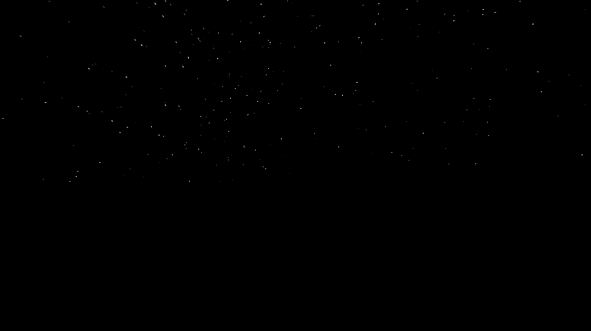
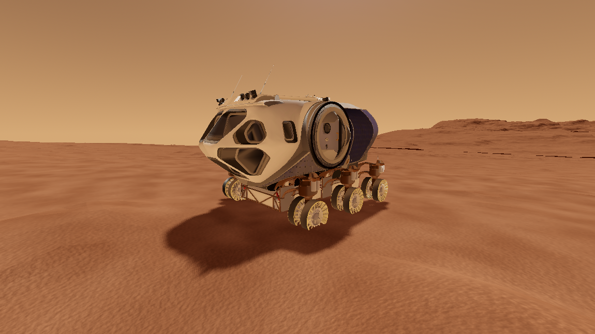

# 🪐 Discover Mars

Discover Mars is an early-stage 3D exploration and educational experience built with Godot. Explore real 3D models of specific locations on the surface of Mars, reconstructed from data captured by NASA's rovers and orbiters. Travel on foot or by rover while learning what current science tells us about Mars and the search for past or present life.

The long-term goal is to turn scientific investigation into interactive gameplay. Players will take part in rover missions, examine simulated data, and discover illustrated information panels about important findings from Mars research.

<div align="center">
  
  <div style="display: inline-block; margin-top: 6px; padding: 6px 14px; border-radius: 6px; background-color: #a6a6a7; color: #000000;">
    <em>A sunrise rendered in Discover Mars</em>
  </div>
</div>

## Project Status

This project is currently a prototype and is under active development. Its present focus is movement, environmental exploration, rover handling, and the visual atmosphere of Mars. Educational missions and science content are planned but not yet fully implemented.

## Current Features

- [x] First-person and third-person exploration
- [x] Walking, sprinting, crouching, and jumping
- [x] A drivable rover with suspension and terrain interaction
- [x] Enter and exit prompts when near the rover
- [x] Real 3D surface models of Gale Crater and Pahrump Hills
- [x] A configurable Mars day/night cycle
- [x] Dynamic sunlight, sky, and ambient lighting
- [x] Optional flight mode for development and exploration
- [x] A mission system with an objective tracker and waypoint markers
- [x] The first rover mission, `MSL-01 Pahrump Hills`

<div align="center">
  
  <div style="display: inline-block; margin-top: 6px; padding: 6px 14px; border-radius: 6px; background-color: #a6a6a7; color: #000000;">
    <em>The drivable exploration vehicle on the Martian surface</em>
  </div>
</div>

## Planned Features

### Rover Missions

Future missions will place the player in the role of a rover science team. Planned activities include:

- [x] Navigating to scientifically interesting locations
- [ ] Photographing and documenting geological formations
- [x] Collecting and comparing rock or soil samples
- [ ] Analysing simulated instrument data
- [ ] Identifying minerals, signs of ancient water, and possible biosignatures
- [ ] Making evidence-based decisions from incomplete data
- [ ] Reviewing mission results and the scientific reasoning behind them

### Scientific Information Panels

Interactive panels will present accessible explanations supported by images, diagrams, and references. Topics may include:

- [ ] Evidence for ancient rivers, lakes, and groundwater
- [ ] The history of Mars' atmosphere and climate
- [ ] Organic molecules and what they do and do not prove
- [ ] Habitable environments and the requirements for life
- [ ] Radiation, temperature, and other challenges for life on Mars
- [ ] Results from missions such as Curiosity, Perseverance, Viking, and Mars Express
- [ ] The difference between confirmed evidence, scientific interpretation, and open questions

Scientific material should reflect the current state of research, cite reliable sources, and clearly communicate uncertainty. The project will not present evidence of habitability as proof that life has been discovered.

## Mission System

The mission tracker appears in the top-right corner and lists the objectives of the
active mission. Each objective moves through three states: pending, active, and
complete. The active objective also places a waypoint in the world — a light beacon
at the target plus a screen marker showing direction and remaining distance. When the
target leaves the field of view, the marker becomes an arrow pinned to the edge of the
screen. The marker follows whichever camera is currently active, so it keeps working
when you switch between walking and driving.

In-game mission text is written in German, matching the existing interaction prompts.

### The first mission

`MSL-01 Pahrump Hills` is modelled on Curiosity's real Pahrump Hills Walkabout. The
rover reached the outcrop at the base of Mount Sharp around Sol 753 (September 2014)
and drilled the "Confidence Hills" target. The rock belongs to the Murray formation
and is interpreted as fine-grained mudstone deposited in a long-lived lake in Gale
Crater. The mission has three objectives: board the exploration vehicle, drive to the
outcrop roughly 300 metres away, and collect a rock sample on foot.

Sources: Grotzinger et al. (2015), *Deposition, exhumation, and paleoclimate of an
ancient lake deposit, Gale crater, Mars*, Science 350 (6257); NASA/JPL-Caltech MSL
mission updates.

### Adding a mission

Missions are plain Godot `Resource` types, so no scene editing is required to define
one. Build a `Mission` and its `MissionObjective` list in `scripts/missions/mission_library.gd`,
then place a `MissionWaypoint` in the scene for each objective that needs a target.
Objectives are completed by calling `MissionManager.report(objective_id)`. Three
ready-made nodes cover the common cases:

| Node | Purpose |
| --- | --- |
| `mission_waypoint.gd` | Marks a location, draws the beacon, and reports arrival |
| `mission_interactable.gd` | Reports when the player presses `F` at an object |
| `mission_signal_trigger.gd` | Reports when any node emits a given signal |

Waypoints drop themselves onto the terrain with a downward raycast at startup, so only
the X and Z coordinates need to be authored.

## Controls

| Action | Input |
| --- | --- |
| Move | `W`, `A`, `S`, `D` |
| Look around | Mouse |
| Jump | `Space` |
| Sprint | `Shift` |
| Crouch | `Ctrl` |
| Switch camera | `C` |
| Enter or exit rover | `F` |
| Exit rover (alternative) | `R` |
| Rover handbrake | `Space` |
| Toggle flight mode | `F4` |
| Release or capture mouse | `Esc` |

## Requirements

- [Godot Engine](https://godotengine.org/) 4.7 or a compatible Godot 4 release
- A system capable of running the Forward+ renderer

## Getting Started

1. Clone or download this repository.
2. Open Godot's Project Manager.
3. Import the project by selecting `project.godot`.
4. Open the project and run the main scene with `F6` or the full project with `F5`.

The main scene is `main.tscn`.

## Project Structure

```text
.
|-- assets/
|   |-- materials/      # Materials and shaders (terrain, sky, mission beacon)
|   |-- models/         # 3D models and textures
|   `-- ui/icons/       # Mission interface icons (SVG)
|-- scripts/
|   |-- missions/       # Mission data, manager, and world trigger nodes
|   |-- ui/             # Mission tracker, waypoint marker, and styling
|   `-- ...             # Rover, terrain, and environment scripts
|-- main.tscn           # Main exploration scene
|-- player.tscn         # Player scene
|-- exploration_vehicle.tscn
|-- project.godot       # Godot project configuration
`-- texture/            # Additional source textures
```

`MissionManager` is registered as an autoload singleton in `project.godot` and holds
the mission state for the whole project.

## Contributing

Contributions, corrections, and ideas are welcome. In particular, the project benefits from help with:

- Godot gameplay and user-interface development
- Mission and data-analysis design
- Scientific review and fact-checking
- Accessible educational writing
- 3D art, diagrams, and properly licensed imagery

When contributing scientific content, include links or citations to primary research or trusted sources such as NASA, ESA, peer-reviewed publications, or recognized research institutions. Clearly label speculative interpretations and avoid overstating conclusions.

## Sources and Attribution

The 3D models of the Martian surface used in this project were obtained from [NASA's 3D Resources catalog](https://science.nasa.gov/3d-resources/), a repository of downloadable models and textures related to NASA missions.

NASA resources remain subject to the [NASA Images and Media Usage Guidelines](https://www.nasa.gov/nasa-brand-center/images-and-media/). Other third-party assets may have separate attribution and licensing requirements.

## License

No project-wide license has been specified yet. Until one is added, all rights are reserved by the respective copyright holders. Third-party assets may be subject to separate licenses.
